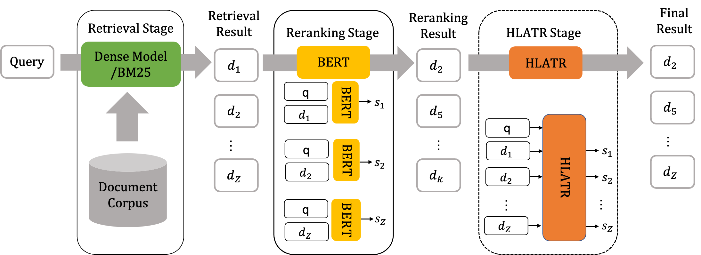

# HLATR

## Introduction

**H**ybrid **L**ist **A**ware **T**ransformer **R**eranking, is a lightweight reranking framework for text retrieval. This framework is premised on combing the retrieval featuring and ranking feature with a list-wise encoder as the reranking model. More details can be found in our [paper](https://arxiv.org/abs/2205.10569).


<p align="center">
  
</p>

**2022-03-17: HLATR got first place on [MS MARCO Passage Ranking Leaderboard](https://microsoft.github.io/MSMARCO-Passage-Ranking-Submissions/leaderboard/).**
  
## Code

The ```retrieval```, ```rerank```, ```hltar``` folders contain how to train a dense passage retrieval, reranking model amd the hltar model. This code is based on the previous work [tevatron](https://github.com/texttron/tevatron) and [reranker](https://github.com/luyug/Reranker) produced by [luyug](https://github.com/luyug). Many thanks to [luyug](https://github.com/luyug). 

## Requirements
```
python=3.8
transformers>=4.18.0
tqdm==4.49.0
datasets>=1.11.0
torch==1.11.0
faiss==1.7.0
scikit-learn== 0.22 
```

## Model Checkpoint
Pre-trained anguage models for MS MARCO PassageRanking LearderBoard (including the retrieval and reranking model) has been gradually open-sourced through [ModelScope platform](https://modelscope.cn/models), welcome to download and experience.
| Model Type  	| Model Name| Url                             	|
|-----------	|------------	|--------------------------------------	|
| Retrieval 	| CoROM    	| [nlp_corom_sentence-embedding_english-base](https://modelscope.cn/models/damo/nlp_corom_sentence-embedding_english-base/summary)                 	|   	| 
| Reranking 	| CoROM-Reranking 	| [nlp_corom_passage-ranking_english-base](https://modelscope.cn/models/damo/nlp_corom_passage-ranking_english-base/summary) 	|

## Citing us

If you feel this paper helpful, please cite us:

```
@article{Zhang2022HLATREM,
  title={HLATR: Enhance Multi-stage Text Retrieval with Hybrid List Aware Transformer Reranking},
  author={Yanzhao Zhang and Dingkun Long and Guangwei Xu and Pengjun Xie},
  journal={ArXiv},
  year={2022},
  volume={abs/2205.10569}
}
```
